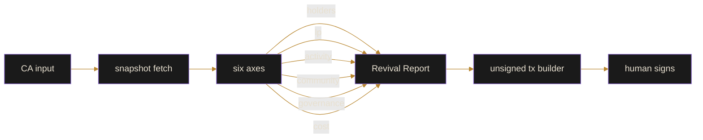

<p align="center">
  
</p>

<p align="center">
  
  
  
</p>

# revxr

> We fix the dead.

Reference tooling for looking at dormant Solana tokens and protocols and
deciding whether there is anything worth reviving. The scanner produces a
Revival Report from on-chain snapshots; the builder assembles unsigned
migration and treasury transactions for a human to sign.

Inspired by the core ideas behind the [Revxr](https://revxr.fun) project.
Live deployment: [revxr.fun](https://revxr.fun) &middot; [@revxrfun](https://x.com/revxrfun).

## Architecture



## Install

```
git clone https://github.com/revxr/revxr.git
cd revxr
npm install
```

## Usage

```ts
import { analyzeToken } from "revxr";
import { readFileSync } from "node:fs";

const holders = JSON.parse(readFileSync("examples/mock-holders.json", "utf-8"));
const pairs = JSON.parse(readFileSync("examples/mock-pairs.json", "utf-8"));

const report = await analyzeToken({
  mint: "So11111111111111111111111111111111111111112",
  holders,
  pairs,
});
console.log(report.score, report.axes);
```

## Axes

The Revival Score is a weighted blend of six axes:

| axis        | weight | what it captures                           |
|-------------|--------|--------------------------------------------|
| holders     | 0.25   | distribution of ownership (gini + top1)    |
| lp          | 0.20   | liquidity depth and pair health            |
| activity    | 0.15   | recent on-chain movement                   |
| community   | 0.15   | retention of non-whale holders             |
| governance  | 0.15   | vote/proposal activity if applicable       |
| cost        | 0.10   | estimated cost to re-seed liquidity        |

## Safety

The builder never signs. It returns a `Transaction` for a wallet to sign.
Memo instructions tag every revival transaction so the on-chain footprint is
auditable. See [docs/safety.md](docs/safety.md).

## Layout

```
src/
  scanner/   core + axes
  reviver/   unsigned tx builder
  common/    utils, gini
examples/    mock fixtures and a runnable example
docs/        philosophy, scoring, safety
tests/       jest suites
```

## License

MIT. See [LICENSE](LICENSE).

## Links

- Live: [https://revxr.fun](https://revxr.fun)
- Twitter: [@revxrfun](https://x.com/revxrfun)
- Repo: https://github.com/revxr/revxr

---

Public reference. The production deployment at revxr.fun is separate.
